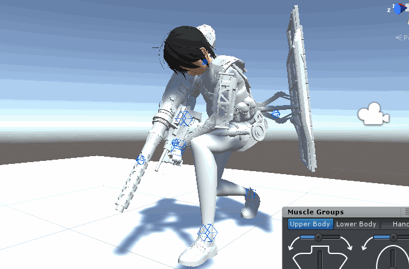
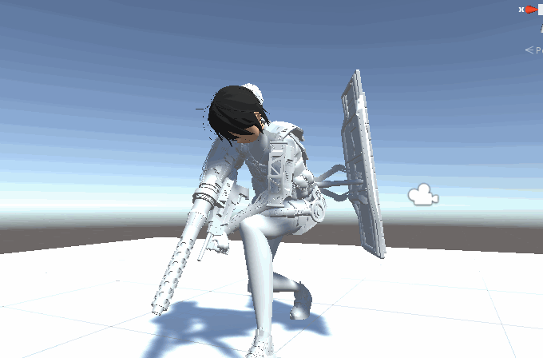

# UMotionProReport

## Version

Unity: 2019.2.3f1
UMotion Pro: 1.19p02

## Bug?

Playback on Clip Editor and the exported animation do not match.

Clip Editor:

Exported animation:

Please pay attention to the left hand.
In Clip Editor, the hand holds the grip,
In the exported animation, the position of the grip is wrong.
